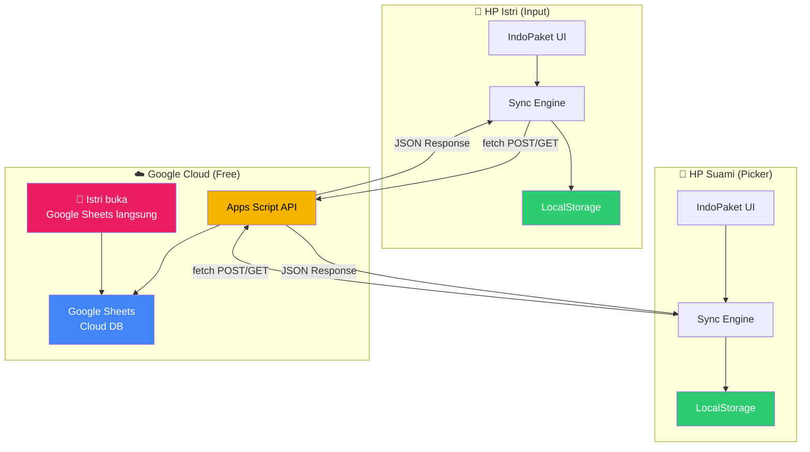
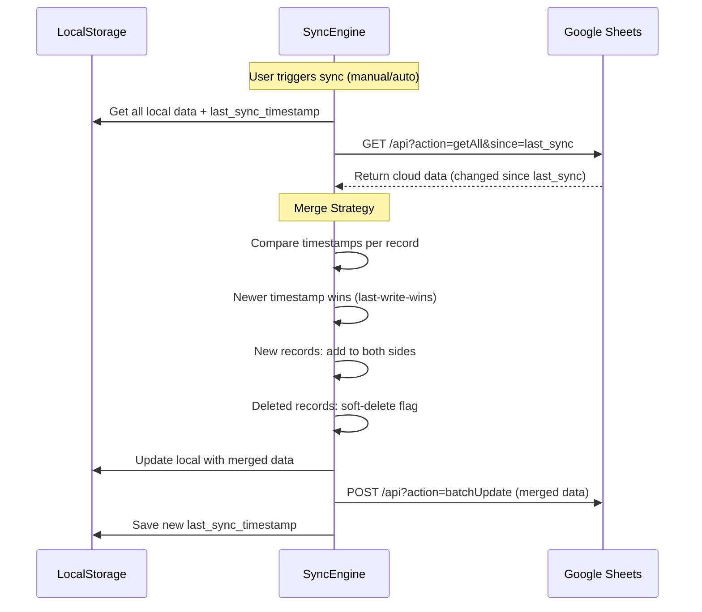

# 📦 IndoPaket Tracker — Hybrid Sync Implementation Plan

> **Fitur**: Google Sheets Cloud Sync + Enhanced Export/Import
> **Arsitektur**: LocalStorage (primary, offline-first) + Google Sheets (cloud backup/sync via Apps Script)

---

## ✅ Keputusan yang Sudah Dikonfirmasi

| # | Keputusan | Detail |
|---|-----------|--------|
| 1 | **Sync mode default: OFF** | User harus aktifkan sync secara manual di Settings |
| 2 | **Google Sheets bisa diakses langsung** | Istri bisa lihat/edit data lewat app DAN langsung di Google Sheets |
| 3 | **Shared sync: 2 device → 1 Google Sheet** | HP istri + HP suami sync ke spreadsheet yang sama |

---

## 🎯 Tujuan

Menambahkan sistem **hybrid storage** ke IndoPaket Tracker:

1. **LocalStorage** tetap jadi primary storage (offline-first, instant)
2. **Google Sheets** sebagai cloud database (sync antar device, backup otomatis)
3. **Export/Import** yang enhanced (JSON + CSV + Google Sheets)
4. User bisa pilih mode: **Offline Only**, **Manual Sync**, atau **Auto Sync** (default: Off)
5. **Shared sync** — 2 device (istri & suami) sync ke 1 Google Sheet yang sama
6. **Google Sheets readable** — istri bisa buka spreadsheet langsung untuk lihat/edit data

---

## 🏗️ Arsitektur



### Multi-Device Shared Sync

Karena 2 device sync ke 1 Google Sheet, diperlukan:

| Aspek | Solusi |
|-------|--------|
| **Device ID** | Setiap device punya unique `device_id` (generated saat pertama setup) |
| **Conflict** | Timestamp-based last-write-wins — siapa yang terakhir edit menang |
| **Direct Sheet Edit** | Istri edit langsung di Google Sheets → App detect perubahan saat sync |
| **Sync Direction** | Bi-directional: Local ↔ Cloud, kedua device push & pull |

### Kenapa Google Apps Script?

| Aspek | Keterangan |
|-------|------------|
| **Gratis** | Tidak perlu server, hosting, atau database berbayar |
| **No Auth Complexity** | Deploy as "Anyone" — tidak perlu OAuth flow di frontend |
| **Familiar** | Data bisa dilihat/edit langsung di Google Sheets |
| **Reliable** | Google infrastructure, 99.9% uptime |
| **Simple** | Hanya perlu 1 file `Code.gs` |

### Limitasi yang Perlu Diketahui

| Limitasi | Detail | Mitigasi |
|----------|--------|----------|
| Latency | ~1-3 detik per request | LocalStorage sebagai primary (instant), sync di background |
| Concurrent writes | Single-threaded | LockService di Apps Script + timestamp-based conflict resolution |
| Daily quota | ~20,000 URL fetch calls/day | Lebih dari cukup untuk 2 user |
| Execution time | 6 menit max per request | Batch operations, bukan per-row |

---

## 📊 Google Sheets Structure

> [!TIP]
> Google Sheets ini juga bisa dibuka langsung oleh istri untuk lihat/edit data.
> Pastikan kolom headers tetap di row 1 dan format data konsisten.
> **Jangan hapus/rename sheet tabs** karena Apps Script bergantung pada nama tab.

### Sheet: `stores`
| id | kode_toko | nama_toko | alamat | created_at | updated_at | _deleted |
|----|-----------|-----------|--------|------------|------------|----------|

### Sheet: `packages`
| id | store_id | nama | nomor_awb | pin | invoice | status | is_urgent | tanggal_masuk | deadline | tanggal_pickup | catatan | created_at | updated_at | _deleted | _last_modified_by |
|----|----------|------|-----------|-----|---------|--------|-----------|---------------|----------|----------------|---------|------------|------------|----------|--------------------|

> `_last_modified_by` = device_id atau `"sheets_direct"` jika diedit langsung di Google Sheets

### Sheet: `trips`
| id | tanggal | status | package_ids | completed_at | created_at | updated_at | _deleted |
|----|---------|--------|-------------|--------------|------------|------------|----------|

### Sheet: `sync_meta`
| key | value |
|-----|-------|
| last_sync_device_1 | ISO timestamp |
| last_sync_device_2 | ISO timestamp |
| version | 1 |

### Sheet: `devices` (baru)
| device_id | device_name | role | last_seen |
|-----------|-------------|------|----------|
| abc123 | HP Istri | input | 2026-06-16T14:30:00Z |
| def456 | HP Suami | picker | 2026-06-16T14:25:00Z |

---

## 🔄 Sync Strategy: Timestamp-Based Last-Write-Wins



### Conflict Resolution Rules

1. **Same record modified on both sides** → `updated_at` yang lebih baru menang
2. **Record exists locally but not in cloud** → Push ke cloud
3. **Record exists in cloud but not locally** → Pull ke local
4. **Record deleted locally** → Soft-delete (`_deleted: true`), sync deletion ke cloud
5. **Both deleted** → Remove from both
6. **Edited langsung di Google Sheets** → Apps Script trigger `onEdit()` set `updated_at` + `_last_modified_by: "sheets_direct"` → next sync picks it up
7. **2 device edit same record** → Tetap last-write-wins berdasarkan `updated_at`

---

## 📋 Task Breakdown

### TASK 13: Google Apps Script Backend

#### Tujuan
Buat Google Apps Script Web App sebagai REST API proxy untuk Google Sheets.

#### 🔀 GitHub Workflow

```bash
# 1. Issue: "[TASK 13] Google Apps Script Backend for Sheets Sync"
#    Labels: enhancement, priority:high, phase:4-sync
#    Milestone: Phase 4 - Cloud Sync

# 2. Branch
git checkout develop && git pull origin develop
git checkout -b feature/task-13-google-sheets-backend

# 3. Commits
git add docs/google-apps-script-setup.md
git commit -m "docs(sync): add Google Apps Script setup guide"

git add gas/Code.gs
git commit -m "feat(sync): add Apps Script Web App with CRUD endpoints"

# 4. PR → develop | Closes #13
```

#### File: `gas/Code.gs` (disimpan di repo sebagai referensi, deploy via Google Apps Script Editor)

```javascript
// Endpoints:
// GET  ?action=getAll&since=TIMESTAMP      → return all data modified since timestamp
// GET  ?action=getStores / getPackages / getTrips
// GET  ?action=getDevices                  → return registered devices
// POST ?action=batchUpdate                 → body: {device_id, data: {stores, packages, trips}}
// POST ?action=fullSync                    → body: {device_id, data: ...} (overwrite all)
// POST ?action=registerDevice              → body: {device_id, device_name, role}

function doGet(e) {
  const lock = LockService.getScriptLock();
  lock.tryLock(10000);
  try {
    const action = e.parameter.action;
    const since = e.parameter.since || null;
    let result;
    switch(action) {
      case 'getAll': result = getAllData(since); break;
      case 'getStores': result = getSheetData('stores', since); break;
      case 'getPackages': result = getSheetData('packages', since); break;
      case 'getTrips': result = getSheetData('trips', since); break;
      case 'getDevices': result = getSheetData('devices'); break;
      case 'ping': result = { status: 'ok', timestamp: new Date().toISOString() }; break;
      default: result = { error: 'Unknown action' };
    }
    return ContentService.createTextOutput(JSON.stringify(result))
      .setMimeType(ContentService.MimeType.JSON);
  } finally { lock.releaseLock(); }
}

function doPost(e) {
  const lock = LockService.getScriptLock();
  lock.tryLock(30000);
  try {
    const payload = JSON.parse(e.postData.contents);
    const action = payload.action;
    let result;
    switch(action) {
      case 'batchUpdate': result = batchUpdate(payload.device_id, payload.data); break;
      case 'fullSync': result = fullSync(payload.device_id, payload.data); break;
      case 'registerDevice': result = registerDevice(payload); break;
      default: result = { error: 'Unknown action' };
    }
    return ContentService.createTextOutput(JSON.stringify(result))
      .setMimeType(ContentService.MimeType.JSON);
  } finally { lock.releaseLock(); }
}

// Trigger: auto-set updated_at when wife edits sheet directly
function onEdit(e) {
  const sheet = e.source.getActiveSheet();
  const tabName = sheet.getName();
  if (['stores', 'packages', 'trips'].includes(tabName)) {
    const row = e.range.getRow();
    if (row > 1) { // Skip header
      const headers = sheet.getRange(1, 1, 1, sheet.getLastColumn()).getValues()[0];
      const updatedAtCol = headers.indexOf('updated_at') + 1;
      const modifiedByCol = headers.indexOf('_last_modified_by') + 1;
      if (updatedAtCol > 0) sheet.getRange(row, updatedAtCol).setValue(new Date().toISOString());
      if (modifiedByCol > 0) sheet.getRange(row, modifiedByCol).setValue('sheets_direct');
    }
  }
}
```

#### File: `docs/google-apps-script-setup.md`

Panduan setup step-by-step:
1. Buka Google Sheets → buat spreadsheet baru "IndoPaket Data"
2. Buat 5 sheet tabs: `stores`, `packages`, `trips`, `sync_meta`, `devices`
3. Tambah headers di row 1 setiap sheet (lihat schema di atas)
4. Extensions → Apps Script → paste `Code.gs`
5. Deploy → New Deployment → Web App → Execute as Me, Anyone can access
6. Copy deployment URL → paste di app Settings **di kedua HP (istri & suami)**
7. **Share spreadsheet** ke akun Google istri (Editor access) agar bisa buka langsung
8. Tambahkan `onEdit` trigger: Triggers → Add Trigger → `onEdit` → From spreadsheet → On edit

> [!IMPORTANT]
> Istri perlu **Editor access** ke Google Sheet agar bisa edit langsung.
> `onEdit()` trigger otomatis update `updated_at` saat istri edit di Sheets.

#### Acceptance Criteria
- [ ] Apps Script deployed sebagai Web App
- [ ] `GET ?action=ping` returns `{status: "ok"}`
- [ ] `GET ?action=getAll` returns semua data dari sheets
- [ ] `POST ?action=batchUpdate` creates/updates rows with device_id tracking
- [ ] `POST ?action=fullSync` overwrites all sheet data
- [ ] `POST ?action=registerDevice` registers new device
- [ ] `onEdit()` trigger auto-updates `updated_at` saat edit langsung di Sheets
- [ ] LockService prevents race conditions
- [ ] Spreadsheet shared ke istri dengan Editor access
- [ ] Setup guide documented for both devices

---

### TASK 14: Sync Engine (js/sync.js)

#### Tujuan
Buat sync engine yang mengelola komunikasi LocalStorage ↔ Google Sheets.

#### 🔀 GitHub Workflow

```bash
# 1. Issue: "[TASK 14] Sync Engine - LocalStorage ↔ Google Sheets"
#    Labels: enhancement, priority:critical, phase:4-sync

# 2. Branch
git checkout develop && git pull origin develop
git checkout -b feature/task-14-sync-engine

# 3. Commits
git add js/sync.js
git commit -m "feat(sync): add SyncEngine with connection test and config storage"

git add js/sync.js
git commit -m "feat(sync): add pull, push, and merge logic with conflict resolution"

git add js/sync.js
git commit -m "feat(sync): add auto-sync interval and online/offline detection"

git add js/db.js
git commit -m "refactor(db): add soft-delete flag and updated_at tracking for sync"

git add index.html
git commit -m "feat(sync): add sync.js script tag to index.html"

# 4. PR → develop | Closes #14
```

#### File: `js/sync.js`

```javascript
const SyncEngine = {
  // Config stored in localStorage
  CONFIG_KEY: 'indopaket_sync_config',
  SYNC_LOG_KEY: 'indopaket_sync_log',
  DEVICE_ID_KEY: 'indopaket_device_id',
  
  getDeviceId() {
    // Generate unique device ID on first run, persist in localStorage
    // Format: 'dev_' + random 8 chars
  },

  getConfig() {
    // Returns: { scriptUrl, deviceName, mode: 'off'|'manual'|'auto', autoIntervalMin: 5, lastSync }
    // Default mode: 'off' — user harus aktifkan manual
  },
  saveConfig(config) { /* ... */ },

  // --- Connection ---
  async testConnection(scriptUrl) {
    // GET scriptUrl?action=ping → validate response
    // Returns: { success: boolean, message: string }
  },

  // --- Core Sync ---
  async sync() {
    // 1. Check online status (navigator.onLine)
    // 2. Get config → validate scriptUrl exists
    // 3. Pull cloud data (since lastSync)
    // 4. Get local data
    // 5. Merge (timestamp-based last-write-wins)
    // 6. Push merged changes to cloud
    // 7. Update local with merged data
    // 8. Save lastSync timestamp
    // 9. Log sync result
    // 10. Dispatch 'sync-complete' event
  },

  async pullFromCloud(since) {
    // GET scriptUrl?action=getAll&since=TIMESTAMP
    // Returns: { stores, packages, trips }
  },

  async pushToCloud(data) {
    // POST scriptUrl { action: 'batchUpdate', data }
  },

  mergeData(localData, cloudData) {
    // For each entity type (stores, packages, trips):
    // - Build map by ID
    // - Compare updated_at timestamps
    // - Newer wins
    // - New records added
    // - Soft-deleted records propagated
    // Returns: { merged, pushToCloud, pullToLocal, conflicts }
  },

  // --- Full Overwrite Operations ---
  async pushAllToCloud() {
    // POST { action: 'fullSync', data: DB.exportAll() }
    // Use case: first-time setup, force push
  },

  async pullAllFromCloud() {
    // GET ?action=getAll
    // Overwrite local data
    // Use case: new device setup, force pull
  },

  // --- Auto Sync ---
  _intervalId: null,
  startAutoSync(intervalMin) {
    // setInterval → this.sync() every N minutes
    // Also listen for navigator.onLine events
  },
  stopAutoSync() {
    // clearInterval
  },

  // --- Status & Logging ---
  getSyncStatus() {
    // Returns: { lastSync, lastResult, pendingChanges, isOnline }
  },
  addLog(entry) {
    // Append to sync log (keep last 50 entries)
  }
};

window.SyncEngine = SyncEngine;
```

#### Edit: `js/db.js`

Tambahkan tracking untuk sync compatibility:

```javascript
// Perubahan di _create():
item.updated_at = new Date().toISOString();
item._deleted = false;
item._synced = false;  // flag: belum di-sync ke cloud

// Perubahan di _update():
// Sudah ada updated_at ✓
// Tambah: items[index]._synced = false;

// Tambah method baru:
softDelete(key, id) {
  // Set _deleted: true + updated_at instead of removing
  // Actual removal happens after successful sync
},

getUnsyncedItems(key) {
  // Return items where _synced === false
},

markAsSynced(key, ids) {
  // Set _synced = true for given IDs
},

cleanupDeleted(key) {
  // Remove items where _deleted === true AND _synced === true
}
```

#### Edit: `index.html`
```html
<script src="js/sync.js"></script>  <!-- Before app.js -->
```

#### Acceptance Criteria
- [ ] `testConnection()` validates Apps Script URL
- [ ] `sync()` successfully merges local and cloud data
- [ ] Timestamp-based conflict resolution works correctly
- [ ] `pushAllToCloud()` exports all data to Google Sheets
- [ ] `pullAllFromCloud()` imports all data from Google Sheets
- [ ] Auto-sync runs at configurable interval
- [ ] Online/offline detection works
- [ ] Sync log tracks last 50 operations
- [ ] DB soft-delete and `_synced` flag working
- [ ] ✅ Branch, commits, PR follow conventions

---

### TASK 15: Enhanced Export/Import

#### Tujuan
Upgrade export/import di Stats page: JSON, CSV, dan Google Sheets sync buttons.

#### 🔀 GitHub Workflow

```bash
# 1. Issue: "[TASK 15] Enhanced Export/Import with Cloud Sync"
#    Labels: enhancement, priority:high, phase:4-sync

# 2. Branch
git checkout develop && git pull origin develop
git checkout -b feature/task-15-enhanced-export-import

# 3. Commits
git add js/stats.js
git commit -m "feat(stats): add CSV export with proper escaping"

git add js/stats.js
git commit -m "feat(stats): add CSV import with column mapping"

git add js/stats.js
git commit -m "feat(stats): add cloud sync buttons (push/pull/full sync)"

git add js/stats.js
git commit -m "feat(stats): add sync status indicator and last sync time"

# 4. PR → develop | Closes #15
```

#### Perubahan di `js/stats.js`

Tambahkan di section Backup & Restore:

```javascript
// Export options:
// 1. Export JSON (existing, enhanced with metadata)
// 2. Export CSV (new — packages only, compatible with spreadsheet)
// 3. Push to Google Sheets (full overwrite ke cloud)

// Import options:
// 1. Import JSON (existing, enhanced with merge option)
// 2. Import CSV (new — packages from spreadsheet)
// 3. Pull from Google Sheets (download dari cloud)

// Sync section (only visible if sync configured):
// - Last sync: "5 menit yang lalu"
// - Status indicator: 🟢 Connected / 🔴 Offline / 🟡 Syncing
// - [🔄 Sync Now] button
// - [⬆️ Force Push] [⬇️ Force Pull] buttons
```

**CSV Export format:**
```
Nama,AWB,PIN,Toko,Status,Tanggal Masuk,Deadline,Urgent
"Tina F.","OR326...","5APH5T","IDM TGR","pending","2026-06-15","2026-06-22","Ya"
```

**CSV Import:** Parse CSV → review table (reuse OCR review pattern) → batch save

#### Acceptance Criteria
- [ ] Export JSON with full metadata
- [ ] Export CSV downloads properly formatted file
- [ ] Import JSON with merge/overwrite option
- [ ] Import CSV with review table before saving
- [ ] Cloud sync buttons work (push/pull)
- [ ] Sync status indicator shows connection state
- [ ] Last sync time displayed in human-readable format
- [ ] ✅ Branch, commits, PR follow conventions

---

### TASK 16: Sync UI & Indicators

#### Tujuan
Tambah visual indicators di header dan UI untuk sync status.

#### 🔀 GitHub Workflow

```bash
# 1. Issue: "[TASK 16] Sync UI & Status Indicators"
#    Labels: enhancement, priority:medium, phase:4-sync

# 2. Branch
git checkout develop && git pull origin develop
git checkout -b feature/task-16-sync-ui

# 3. Commits
git add js/dashboard.js
git commit -m "feat(sync): add sync status badge in header"

git add js/app.js
git commit -m "feat(sync): add sync initialization and event listeners"

git add css/style.css
git commit -m "style(sync): add sync indicator animations and cloud icon styles"

# 4. PR → develop | Closes #16
```

#### Perubahan:

**Header** (di `index.html` atau rendered via JS):
```html
<header class="app-header">
    <h1>IndoPaket Tracker</h1>
    <div id="sync-indicator" class="sync-badge" onclick="App.navigate('settings')">
        <!-- Dynamic: -->
        <!-- 🟢 ☁️ (synced) -->
        <!-- 🟡 ☁️↻ (syncing, with spin animation) -->
        <!-- 🔴 ☁️✕ (offline/error) -->
        <!-- ⚫ (sync not configured) -->
    </div>
</header>
```

**CSS animations:**
```css
.sync-badge { /* cloud icon in header */ }
.sync-badge.syncing { animation: spin 1s linear infinite; }
.sync-badge.synced { color: var(--color-success); }
.sync-badge.offline { color: var(--color-danger); }
.sync-badge.not-configured { color: var(--color-text-muted); }
```

**Event Flow:**
```javascript
// In app.js:
window.addEventListener('sync-complete', (e) => {
  // Update sync indicator
  // Show toast: "✅ Data tersinkronisasi" or "⚠️ Sync gagal: ..."
});

window.addEventListener('online', () => {
  // Update indicator, trigger sync if auto mode
});

window.addEventListener('offline', () => {
  // Update indicator, show "Mode offline" toast
});
```

#### Acceptance Criteria
- [ ] Sync badge visible in header
- [ ] Badge shows correct state (synced/syncing/offline/not-configured)
- [ ] Spin animation during sync
- [ ] Click badge → navigate to settings
- [ ] Online/offline events update badge
- [ ] Toast notifications for sync results
- [ ] ✅ Branch, commits, PR follow conventions

---

### TASK 17: Settings Page (Sync Configuration)

#### Tujuan
Halaman settings untuk konfigurasi Google Sheets sync.

#### 🔀 GitHub Workflow

```bash
# 1. Issue: "[TASK 17] Settings Page - Sync Configuration"
#    Labels: enhancement, priority:high, phase:4-sync

# 2. Branch
git checkout develop && git pull origin develop
git checkout -b feature/task-17-settings-page

# 3. Commits
git add js/settings.js
git commit -m "feat(settings): add settings page with sync configuration form"

git add js/settings.js
git commit -m "feat(settings): add connection test and sync mode toggle"

git add js/settings.js
git commit -m "feat(settings): add sync log viewer and danger zone actions"

git add index.html
git commit -m "feat(settings): add settings view, nav item, and script tag"

git add js/app.js
git commit -m "feat(settings): register settings route and init sync on startup"

# 4. PR → develop | Closes #17
```

#### File: `js/settings.js`

```javascript
const Settings = {
  render() {
    // Section 1: Device Info
    // - Device ID: "dev_abc123" (auto-generated)
    // - Input: Device Name (e.g. "HP Istri" / "HP Suami")
    // - Dropdown: Role (Input / Picker)
    // - Info: "Device ini terdaftar sebagai [role]"

    // Section 2: Google Sheets Sync
    // - Input: Apps Script URL
    // - Button: [🔗 Test Koneksi]
    // - Status: "✅ Terhubung" / "❌ Gagal"
    // - Dropdown: Sync Mode (Off / Manual / Auto) — default: OFF
    // - If Auto: Input interval (5/10/15/30 menit)
    // - Button: [💾 Simpan Konfigurasi]

    // Section 3: Connected Devices
    // - List devices yang terdaftar di Google Sheet
    // - Tampilkan: nama, role, last seen
    // - e.g. "📱 HP Istri (Input) — terakhir sync 5 menit lalu"
    // - e.g. "📱 HP Suami (Picker) — terakhir sync 2 jam lalu"

    // Section 4: Sync Actions
    // - Last sync: "15 Jun 2026, 14:30"
    // - [🔄 Sync Sekarang]
    // - [⬆️ Force Push ke Cloud] (overwrite cloud)
    // - [⬇️ Force Pull dari Cloud] (overwrite local)

    // Section 5: Sync Log
    // - Scrollable list of last 20 sync events
    // - Each: timestamp + result + device + details

    // Section 6: Data Management
    // - [📤 Export JSON] [📤 Export CSV]
    // - [📥 Import JSON] [📥 Import CSV]

    // Section 7: Danger Zone
    // - [🗑️ Hapus Semua Data Lokal]
    // - [🗑️ Hapus Semua Data Cloud]
    // - Both with double-confirm
  },

  async testConnection() { /* ... */ },
  saveConfig() { /* ... */ },
  async registerDevice() { /* POST registerDevice to Apps Script */ },
  async loadConnectedDevices() { /* GET getDevices */ },
  handleSyncNow() { /* ... */ },
  handleForcePush() { /* ... */ },
  handleForcePull() { /* ... */ }
};
window.Settings = Settings;
```

#### Edit: `index.html`
```html
<!-- New view -->
<div id="view-settings" class="view" style="display: none;"></div>

<!-- Nav: add settings icon/gear -->
<!-- Or: accessible from header gear icon -->

<!-- Script tag -->
<script src="js/settings.js"></script>
```

#### Edit: `js/app.js`
- Register 'settings' route
- On init: load sync config → if auto mode, start auto sync
- Add gear icon to header (navigates to settings)

#### Acceptance Criteria
- [ ] Settings page accessible from header gear icon
- [ ] Apps Script URL can be saved and tested
- [ ] Connection test shows success/failure
- [ ] Sync mode (Off/Manual/Auto) configurable
- [ ] Auto sync interval configurable
- [ ] Force push/pull with confirmation
- [ ] Sync log shows recent operations
- [ ] Export/Import buttons work (JSON & CSV)
- [ ] Danger zone has double-confirm
- [ ] ✅ Branch, commits, PR follow conventions

---

## 🔢 Urutan Eksekusi

```
TASK 13 (Apps Script Backend)
    ↓
TASK 14 (Sync Engine)
    ↓
TASK 15 (Enhanced Export/Import) ← bisa parallel dengan Task 16
TASK 16 (Sync UI & Indicators)  ← bisa parallel dengan Task 15
    ↓
TASK 17 (Settings Page)
    ↓
Release v0.3.0 (Cloud Sync) 🎉
```

> [!IMPORTANT]
> Task 13 HARUS selesai dulu karena semua task lain bergantung pada Apps Script URL.
> Task 14 adalah core engine yang dibutuhkan Task 15-17.

---

## 🚀 Setup Guide (Ringkas)

### Step 1: Buat Google Sheet
1. Buka [Google Sheets](https://sheets.google.com) → Buat spreadsheet baru
2. Rename ke "IndoPaket Data"
3. Buat 4 sheet tabs: `stores`, `packages`, `trips`, `sync_meta`
4. Tambah headers di row 1 sesuai schema di atas

### Step 2: Deploy Apps Script
1. Di spreadsheet → Extensions → Apps Script
2. Paste kode dari `gas/Code.gs`
3. Deploy → New Deployment → Web App
4. Execute as: **Me** | Access: **Anyone**
5. Copy URL deployment

### Step 3: Konfigurasi di App
1. Buka IndoPaket Tracker → Settings (gear icon)
2. Paste Apps Script URL
3. Klik "Test Koneksi"
4. Isi Device Name (e.g. "HP Istri") dan Role (Input/Picker)
5. Pilih Sync Mode (Manual/Auto) — default OFF, aktifkan manual
6. Done! ✅
7. **Ulangi step 1-6 di HP kedua** (suami/istri) dengan Apps Script URL yang sama

---

## 📋 GitHub Release Checklist

### Release v0.3.0 — Cloud Sync (setelah Task 17)
```bash
git checkout main && git merge develop
git tag -a v0.3.0 -m "release: Phase 4 - Cloud Sync & Enhanced Export/Import"
git push origin main --tags
```

**Release notes:**
- ✅ Google Sheets cloud sync via Apps Script
- ✅ Shared sync: 2 device → 1 Google Sheet
- ✅ Device registration & tracking
- ✅ Direct Google Sheets editing support (wife)
- ✅ Offline-first with background sync
- ✅ Enhanced export/import (JSON + CSV)
- ✅ Sync status indicators
- ✅ Settings page with sync & device configuration
- ✅ Conflict resolution (last-write-wins with device tracking)
