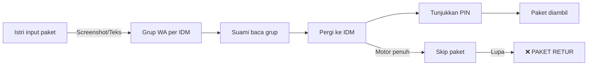
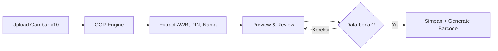
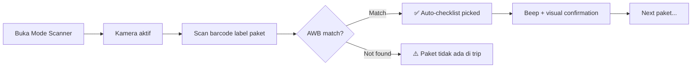
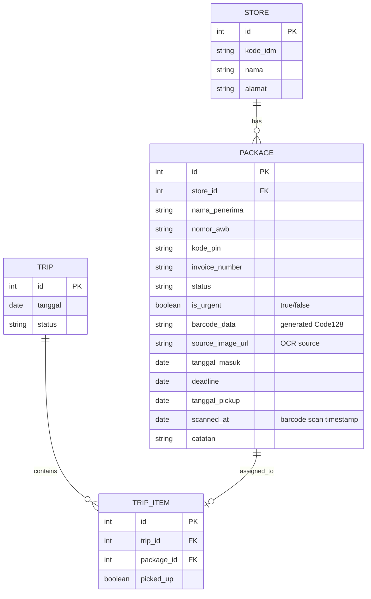
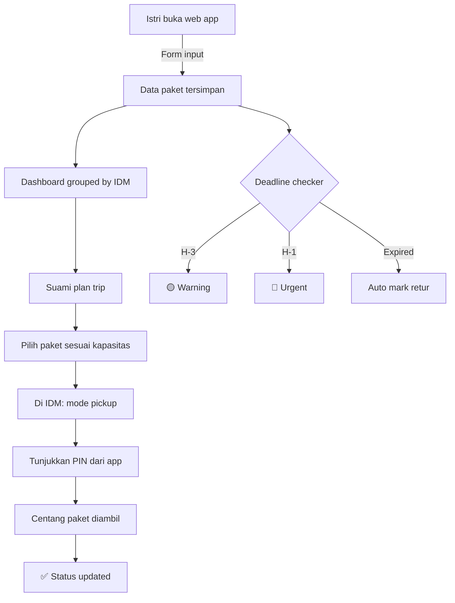

# 📦 IndoPaket Tracker — Solusi Manajemen Pengambilan Paket

## 1. Analisis Masalah

### Workflow Saat Ini


### Pain Points
| # | Masalah | Dampak |
|---|---------|--------|
| 1 | Terlalu banyak grup WA (per lokasi IDM) | Informasi tersebar, sulit dilacak |
| 2 | Screenshot sulit di-search | Tidak bisa filter/sort berdasarkan status |
| 3 | Paket di-skip lalu terlupa | Paket retur, rugi biaya kirim ulang |
| 4 | Tidak ada reminder deadline | Tidak tahu kapan paket expired |
| 5 | Tidak ada prioritas pengambilan | Tidak tahu IDM mana yang paling banyak |
| 6 | Kapasitas motor terbatas | Perlu planning rute & jumlah per trip |

### Data yang Tersedia per Paket
Dari screenshot dan label fisik yang dilampirkan:
- **Nama Penerima** (misal: Tina Fitriyani, Rani Dewanti Sari)
- **Nomor AWB** (misal: OR3260525101608)
- **Kode PIN** (misal: 5APH5T, TY9UGG)
- **Kode Toko IDM** (misal: TGR / TIL5 — H.12)
- **Tanggal Masuk** / Diperbarui Aktif
- **Invoice Number**
- **Alamat Pengiriman**
- **Kurir** (Indopaket)

---

## 2. Solusi: Web App "IndoPaket Tracker"

### Konsep Utama
Web app sederhana yang digunakan berdua (istri sebagai **input**, suami sebagai **picker**) untuk mengelola semua paket dari satu dashboard — menggantikan puluhan grup WhatsApp.

### User Roles
| Role | Pengguna | Aksi Utama |
|------|----------|------------|
| **Admin/Input** | Istri | Tambah paket, update info, lihat status |
| **Picker** | Suami | Lihat daftar pickup, update status, lihat rute |

---

## 3. Fitur Utama

### 3.1 📥 Input Paket (Istri)
- **Form input manual**: Nama, AWB, PIN, Lokasi IDM, Tanggal masuk
- **Bulk input**: Copy-paste tabel dari spreadsheet
- **Deadline otomatis**: Auto-hitung H+7 (atau custom) dari tanggal masuk
- **🔥 Tandai Urgent**: Istri bisa toggle paket sebagai **Urgent** atau tidak saat input:
  - ⬜ **Normal** — Pengambilan standar, prioritas berdasarkan deadline
  - 🔴 **Urgent** — Harus segera diambil (customer komplain, barang penting, dsb)
  - Paket urgent selalu **muncul paling atas** di dashboard & trip planner
  - Contoh: Paket H-5 tapi di-set Urgent → tetap muncul paling atas

### 3.1.1 📸 Bulk Upload Gambar + OCR Auto-Extract
Fitur ini menggantikan proses screenshot ke WA — istri cukup upload gambar langsung ke app.

**Cara Kerja:**
1. Istri tap tombol **"Upload Screenshot"**
2. Pilih **banyak gambar sekaligus** (bulk upload, drag & drop, atau dari kamera)
3. App jalankan **OCR (Optical Character Recognition)** pada setiap gambar
4. OCR auto-extract data:
   - **Nomor AWB** (pattern: `OR3260...`)
   - **Kode PIN** (pattern: 5-6 karakter alfanumerik)
   - **Nama Penerima**
   - **Kode Toko IDM**
5. Data hasil OCR ditampilkan untuk **review & koreksi** sebelum disimpan
6. Istri bisa set **tingkat urgensi** per paket sebelum konfirmasi

**OCR Flow:**


**Tech OCR:**
| Opsi | Library | Kelebihan |
|------|---------|----------|
| Client-side | **Tesseract.js** | Gratis, offline, no server |
| Cloud | **Google Vision API** | Akurasi tinggi, berbayar |
| Hybrid | Tesseract.js + fallback Cloud | Best of both |

### 3.2 📋 Dashboard Paket
- **Filter** berdasarkan: Lokasi IDM, Status, Tanggal, Prioritas
- **Sort** berdasarkan: Deadline terdekat, Jumlah per IDM
- **Search** berdasarkan: Nama, AWB, PIN
- **Status badges** dengan warna:
  - 🟢 Baru masuk
  - 🟡 Menunggu pickup (> 3 hari)
  - 🔴 Urgent (< 2 hari sebelum retur)
  - ✅ Sudah diambil
  - ⚫ Retur / Expired

### 3.3 🗺️ Rute Pickup (Suami)
- **Grouped by IDM**: Lihat berapa paket per toko IDM
- **Trip planner**: Pilih paket yang mau diambil trip ini (estimasi muatan motor)
- **Quick PIN view**: Tap untuk lihat PIN besar (mudah ditunjukkan ke petugas)
- **Sort by urgency**: Paket Urgent ditampilkan paling atas

### 3.3.1 📱 Barcode Scanner — Auto-Checklist Pickup
Fitur killer yang mengubah proses pickup jadi seamless:

**Cara Kerja:**
1. Dari AWB yang sudah tersimpan, app **generate barcode** (Code128) yang identik dengan barcode di label fisik paket
2. Saat di IDM, suami buka **mode Scanner** di app
3. Arahkan kamera HP ke **label barcode di paket fisik**
4. App scan → **match dengan AWB di database** → ✅ **auto-checklist** paket sebagai "Sudah Diambil"
5. Tidak perlu centang manual — tinggal scan, done!

**Scanner Flow:**


**Keuntungan vs Manual Checklist:**
| Aspek | Manual Centang | Barcode Scan |
|-------|---------------|-------------|
| Kecepatan | ~5 detik/paket | ~1 detik/paket |
| Akurasi | Bisa salah centang | 100% match AWB |
| Bukti pickup | Tidak ada | Timestamp + AWB log |
| Hands-free | Perlu ketik/tap | Scan & go |

**Tech Barcode:**
| Fungsi | Library | Keterangan |
|--------|---------|------------|
| Generate barcode | **JsBarcode** | Render AWB → Code128 barcode |
| Scan barcode | **html5-qrcode** / **QuaggaJS** | Kamera HP → decode barcode |
| Format | **Code128** | Standard yang sama dengan label Indopaket |

### 3.4 ⏰ Sistem Reminder
- **Notifikasi browser** untuk paket mendekati deadline
- **Daily summary**: Ringkasan paket yang harus diambil hari ini
- **Escalation**: Warning bertingkat (H-3, H-1, H-Day)

### 3.5 📊 Laporan & Statistik
- Total paket per periode
- Rata-rata waktu pickup
- Jumlah paket retur (target: 0)
- Performa per lokasi IDM

---

## 4. Data Model



---

## 5. Tech Stack

### Opsi A: Paling Simpel (Recommended untuk start)
| Layer | Tech | Alasan |
|-------|------|--------|
| Frontend | **Vanilla HTML/CSS/JS** | Ringan, tanpa build tool |
| Backend | **LocalStorage** | Tidak perlu server |
| Hosting | **GitHub Pages** | Gratis |
| Notifikasi | **Browser Notification API** | Built-in |

### Opsi B: Lebih Scalable
| Layer | Tech | Alasan |
|-------|------|--------|
| Frontend | **SvelteKit** | Reaktif, ringan |
| Backend | **Supabase** | Auth, DB, Realtime |
| Hosting | **Vercel** | Free tier cukup |

> [!TIP]
> Mulai dengan **Opsi A** (LocalStorage + PWA) untuk MVP cepat. Migrasi ke Opsi B jika butuh sync antar device.

---

## 6. Wireframe

### Dashboard
```
┌─────────────────────────────────────────┐
│  📦 IndoPaket Tracker        [+ Paket]  │
├─────────────────────────────────────────┤
│ ⚠️ 3 paket deadline besok!             │
├─────────────────────────────────────────┤
│ 🔍 Search AWB / Nama / PIN...          │
│ [Semua] [Pending] [Urgent] [Selesai]   │
├─────────────────────────────────────────┤
│ 📍 IDM Raya Tiga Raksa (TGR) — 5 paket │
│ ┌─────────────────────────────────────┐ │
│ │ 🔴URG  Tina Fitriyani               │ │
│ │ AWB: OR3260525101608  ||||||||||||| │ │
│ │ PIN: 5APH5T  ⏰ H-2   [🔴 Urgent] │ │
│ └─────────────────────────────────────┘ │
│ ┌─────────────────────────────────────┐ │
│ │       Rani Dewanti Sari              │ │
│ │ AWB: OR3260608082225  ||||||||||||| │ │
│ │ PIN: TY9UGG  ⏰ H-5   [🟢 OK]     │ │
│ └─────────────────────────────────────┘ │
└─────────────────────────────────────────┘
```

### Mode Pickup di IDM (with Scanner)
```
┌─────────────────────────────────────────┐
│  📍 IDM Raya Tiga Raksa                │
│  [📷 SCAN BARCODE]  ← tap to scan     │
├─────────────────────────────────────────┤
│ ┌─────────────────────────────────────┐ │
│ │ 🔴URG  ████ PIN: 5APH5T ████       │ │
│ │ Tina Fitriyani                      │ │
│ │ AWB: OR3260525101608                │ │
│ │ ||||||||||||||||||||||||| (barcode)  │ │
│ │ [✅ Diambil] [📷 Scan] [⏭ Skip]    │ │
│ └─────────────────────────────────────┘ │
│ ┌ ─ ─ ─ ─ ─ ─ ─ ─ ─ ─ ─ ─ ─ ─ ─ ─ ┐ │
│   ✅ SCANNED! AWB: OR3260525101608     │
│   Rani Dewanti — auto-checked 14:32    │
│ └ ─ ─ ─ ─ ─ ─ ─ ─ ─ ─ ─ ─ ─ ─ ─ ─ ┘ │
│ Progress: 2/3 paket (1 scanned)        │
└─────────────────────────────────────────┘
```

### Trip Planner
```
┌─────────────────────────────────────────┐
│  🛵 Plan Trip — Kapasitas: [5] paket   │
├─────────────────────────────────────────┤
│ ☑ IDM TGR — 3 paket (1 urgent)        │
│   ☑ Tina F. — PIN: 5APH5T ⏰ H-1     │
│   ☑ Rani D. — PIN: TY9UGG ⏰ H-5     │
│   ☐ Budi S. — PIN: XK3M9P ⏰ H-6     │
│ ☐ IDM CKP — 2 paket                   │
│   ☐ Sari A. — PIN: AB12CD ⏰ H-4     │
│ Selected: 3/5       [🚀 Mulai Trip]    │
└─────────────────────────────────────────┘
```

---

## 7. Implementasi Bertahap

### Phase 1: MVP (1-2 minggu)
- [ ] Setup project (HTML/CSS/JS + LocalStorage)
- [ ] CRUD Toko IDM (kode, nama, alamat)
- [ ] CRUD Paket (nama, AWB, PIN, status, deadline, **urgent toggle**)
- [ ] Dashboard dengan filter & search
- [ ] Status badges (warna berdasarkan deadline + urgent flag)
- [ ] **Barcode generation** dari AWB (JsBarcode)
- [ ] PWA manifest + service worker

### Phase 2: Productivity (minggu 3-4)
- [ ] Trip planner (urgent dulu → lalu deadline)
- [ ] Mode pickup (PIN besar + checklist)
- [ ] **📷 Barcode Scanner** — scan label paket → auto-checklist
- [ ] Browser notification untuk deadline
- [ ] Bulk input (paste dari spreadsheet)
- [ ] **📸 Bulk upload gambar + OCR** (Tesseract.js)
- [ ] Statistik sederhana

### Phase 3: Advanced (bulan 2+)
- [ ] Migrasi ke Supabase (sync antar device)
- [ ] Multi-user (istri & suami login terpisah)
- [ ] OCR accuracy improvement (Google Vision API fallback)
- [ ] WhatsApp Bot (forward pesan → auto input)
- [ ] Export laporan (CSV/PDF)

---

## 8. Workflow Baru



### Before vs After

| Aspek | Sebelum (WA) | Sesudah (Web App) |
|-------|-------------|-------------------|
| Input paket | Screenshot ke grup | Form + **bulk upload gambar** |
| OCR extract | Manual ketik | **Auto-extract** AWB & PIN |
| Cari paket | Scroll chat | Search & filter |
| Tracking status | Ingatan sendiri | Dashboard real-time |
| Deadline | Tidak tahu | Auto-reminder H-3, H-1 |
| Prioritas | Tidak ada | **Toggle Urgent** (ya/tidak) |
| Planning trip | Perkiraan | Trip planner + kapasitas + urgent first |
| Di lokasi IDM | Cari screenshot | **Scan barcode → auto-checklist** |
| Paket terlupa | Sering retur | ✅ Notifikasi otomatis |
| Jumlah grup WA | 10+ grup | 0 (semua di 1 app) |

---

## 9. Estimasi Biaya

| Item | Biaya |
|------|-------|
| Development (DIY) | Rp 0 |
| Hosting (GitHub Pages) | Rp 0 |
| Domain (opsional) | ~Rp 150.000/tahun |
| Supabase free tier | Rp 0 |
| **Total MVP** | **Rp 0** |

---

## 10. Struktur Project

```
indopaket-tracker/
├── index.html
├── css/
│   └── style.css
├── js/
│   ├── app.js
│   ├── store.js
│   ├── dashboard.js
│   ├── trip.js
│   ├── reminder.js
│   ├── ocr.js            # Tesseract.js OCR engine
│   ├── barcode.js         # JsBarcode generate + html5-qrcode scan
│   └── utils.js
├── manifest.json
└── sw.js
```

> [!IMPORTANT]
> **Next Step**: Jika setuju dengan solusi ini, saya bisa langsung mulai **coding Phase 1 MVP** — web app siap pakai dengan input paket, dashboard, dan reminder system.
